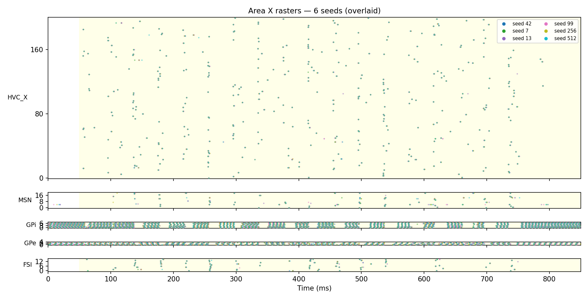
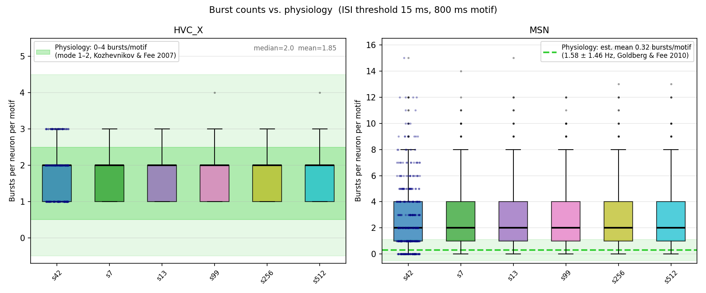
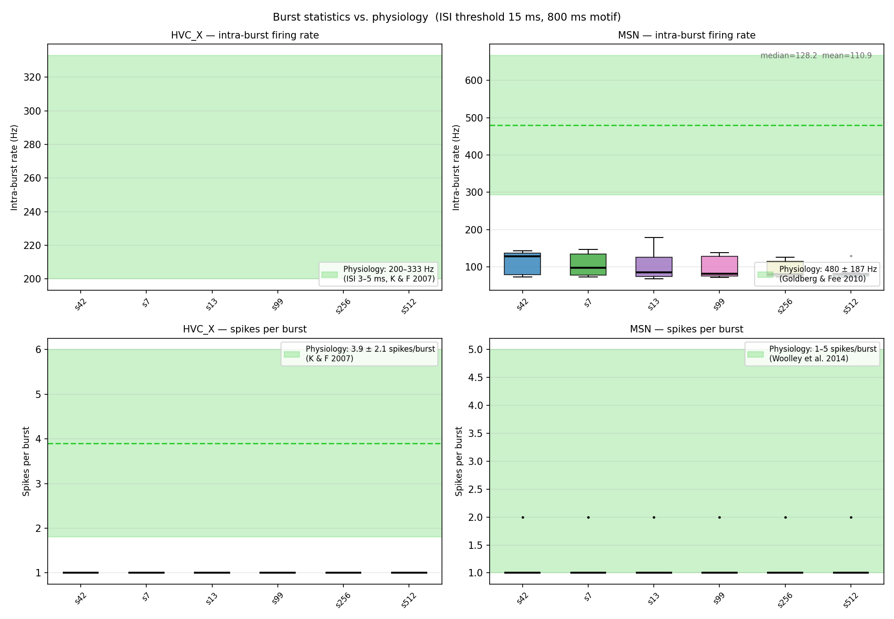
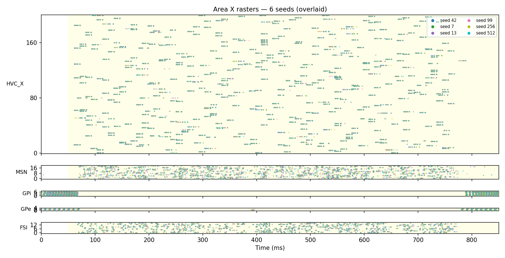
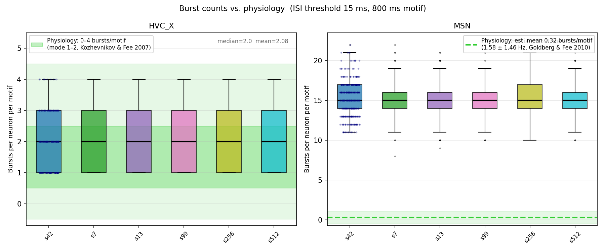
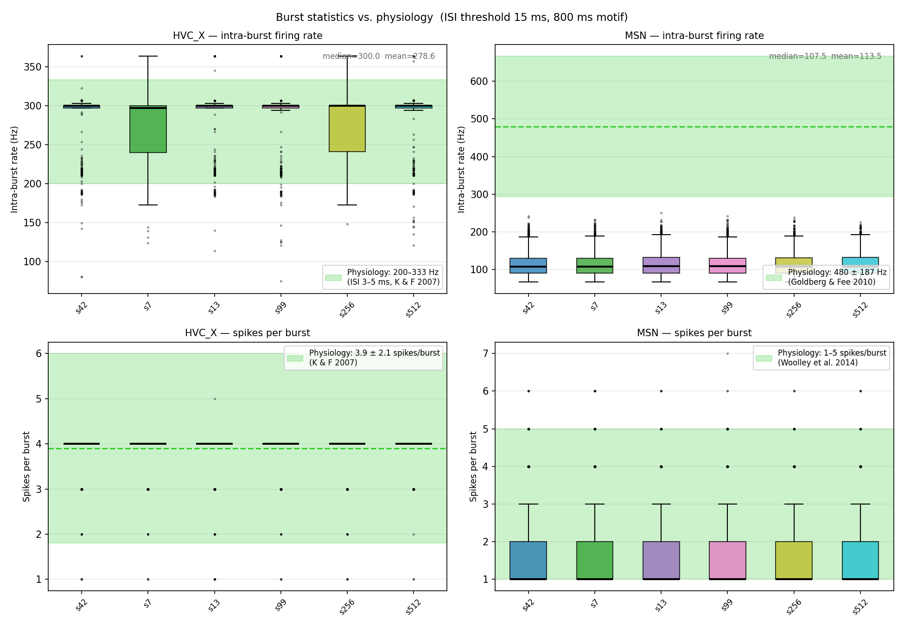

## Being a PI is hard
<iframe 
  src="https://www.facebook.com/plugins/video.php?href=https%3A%2F%2Fwww.facebook.com%2F60minutes%2Fvideos%2Fi-have-no-technical-ability-and-i-know-nothing-about-music%2F562321142436012%2F&show_text=false&width=734&hd=1"
  width="734" 
  height="413" 
  style="border:none;overflow:hidden" 
  scrolling="no" 
  frameborder="0" 
  allowfullscreen="true" 
  allow="autoplay; clipboard-write; encrypted-media; picture-in-picture; web-share">
</iframe>

## Yes, yes, I know

::: {.callout-warning} 
## Disclaimer
I have as many concerns (societal, environmental, ethical) about AI models as you do. I am happy to discuss these offline. I may not be using these models in a year. My goal today is to show you _what they are capable of_ without necessarily endorsing their use.
:::


## What is vibe coding?
::: {.callout-note}
## Vibe coding
Use of large language models (LLMs) like Copilot (GitHub), Cursor, Codex (OpenAI), or Claude Code (Anthropic) to write software, often with minimal human intervention.
:::

## Isn't this _insane?_
_Quite possibly!_

It is also incredibly powerful. 

At the very least, you need to be aware of limitations and footguns.

## Some personal history
A highly simplified timeline:

- **Fall 2023:** Impressive on simple things, problems with complicated problems. Quickly devolved into hard-to-fix bugs.
- **Spring 2025:** "Agentic Coding" models can now use command-line tools, browsers, etc. to get information and interact with the world.
- **November 2025:** Takeoff. Claude Code turns a major corner. Reports all over social media. Agentic tools hit an inflection point.

## A mental model
You will be surprised by how powerful these tools are. 

You will be dumbfounded at how stupid these tools can be.

::: {.callout-tip}
## My best mental model
Claude Code is as good as the best undergrads I've ever had.
:::

Capable of tremendous things, but you'd better check up on it.

## How do you work with an agent?
- Provide clear, detailed instructions. They are not alive, they don't "understand," but more detail is better.
- Check their work. If you're a PI, use your PI skills:
	- Ask for plots. Lots of plots.
	- Have it do control experiments.
- Agents have a "context window" that controls what they know. Use "fresh" agents to check each other's work.

. . .

#### [What would a student have to show you to prove the code works?]{style="color:red;"}


## Case study: song circuits

- My goal is to create a biophysically plausible spiking neuron model of the entire song circuit.

- My student has graduated and has more important things to finish.

- I would never have time to do this myself under normal circumstances.

## Phase I: Research 
I created a project on [claude.ai](https://claude.ai/chat/3f990d69-2284-49a3-a48f-5855c9054dd2), turned on "Research" and prompted it.


Claude summarized _hundreds_ of sources from the internet, including pubmed, arXiv, and [ModelDB](https://modeldb.science). It created a **13 page pdf** complete with parameter tables and equations.

## Some caveats
Seems great, right?

- Initially, many tables were missing numbers. I had to prompt Claude to go back and fill them in. 
- At least one model link was a 404.
- I asked whether the document contained estimates of actual cell numbers, and it had to go back and include that information.

## Pitfall: Cognitive debt
Confession: I didn't read these reports. 

. . .

Well, I skimmed them. 

. . .

::: {.callout-note}
## Cognitive Debt
Like technical debt, but for mental resources. Cognitive debt accrues when results are produced faster than you as a human have time to think about them carefully.
:::

## Enter Claude Code
CC is more powerful than the chat window or the app:

- Using chat forces you to copy/paste over and over 
- The app has to regenerate all code from scratch each time.
- This burns a _lot_ of tokens. 
- CC can edit your files directly, run tests, interface with GitHub, install packages, etc.
- **Be careful!** There are [security risks](https://code.claude.com/docs/en/security).

## Phase II: Initial model creation
CC has a `/plan` mode that allows you to explore options and interact _before any code is written._ 

> I want to make a spiking neural network simulation based on the research in @docs/HVC_X_Neuron_models.md. I'd like to use the Brian 2 Python package. For this project, I want to model some HVC to Area X neurons that burst a few times each and cover the 0.8 seconds of a zebra finch song motif. Once complete, the code should produce a raster plot that shows each neuron bursting during song. Time should be on the x axis and each neuron should be a row, ordered by the time of their first bursts.

## Results (as summarized by Claude):

Claude asked three clarifying questions; answers were:

- Number of HVC_X neurons → **200**
- Model complexity → **Level 3 — AdEx + T-type rebound (Recommended)**
- Bursting mechanism → **Tonic inhibition + disinhibition windows (Recommended)**

. . .

This produced `main.py` (the initial commit): 200 HVC_X AdEx neurons with 2-gate T-type rebound, driven by tonic virtual interneurons with per-neuron disinhibition windows.

## Checking Phase II:
I had Claude make a raster plot, and some issues immediately showed up:

- Many neurons burst at the same time. Instead of tiling the motif, they were locked at particular points.

- I didn't notice this at the time, but the intra-burst rate was way too low.

- I had to ask Claude to input jitter of GABAergic inputs to the cells and choose a better method for selecting burst times.

- I confirmed (again by raster) that bursts now tiled the motif.

## Phase III: Adding Area X

> I'd now like to add connections from these HVC neurons to Area X based on @"docs/Area X composition.md" with dynamics based on @"docs/Area X spiking models.md". I'd like to preserve ratios between HVC inputs and other cell types. It will be difficult to get everything right, but my primary interest is in the spiking behavior of spiny neurons and the output pallidal cells. Propose both a simple (AdEx or similar) and fully biophysical (Hodgkin-Huxley) version of the expanded model. Also propose some functional tests (plots or otherwise) we could use to verify everything is working properly.

<!-- During research to create these documents, I'd told Claude to pay specific attention to recent connectomics results for this region. -->

## Checking Phase III
In looking at the rasters, I immediately noticed problems:

> Please describe the setup for making the raster plot in the new version of the model.
> Are we simply allowing the network to reach steady-state over the first 400ms?
> Why do MSNs only start firing around 400 ms?

- Claude correctly noted that the simulation hadn't started at steady-state, so I asked it to add a burn-in period prior to the motif.

- Claude did this **and auto-tuned the model parameters** until it was satisfied that things were working as planned.

## Pro: self-checking

::: {.callout-tip}
Tools like CC are now quite good at _checking themselves_ if you tell them what to pay attention to. They will compute diagnostics, check them against specs, and make parameter changes to best match what you want.
:::


## Con: churn time

::: {.callout-warning}
Because of self-checking, models can take a long time (15min - 1hr) to return. This eats \$\$\$ and time. You can stop the model at any time to give it hints, but this is a rate-limiting factor.
 
They are not always smart about how they vary parameters. 

Again, _think undergrad._
:::


## More checking Phase III
- Results from the new model _seemed_ pretty good, but I also know some details about the system. 

- I asked Claude to run multiple simulations to look at reliability of MSN firing. It was all over the place!

- This led to a whole round of tuning the model to try to get the correct firing statistics.

## Starting over
I decided that simplified neuron models weren't cutting it. 

> We've been having some trouble with the simplified Area X model, so I'd like to try the following:
>
::: {.nonincremental}
>  - Check out a new branch named "hh".  
>  - Switch from the simplified to the Hodgkin-Huxley based neuron model for Area X cells.
>  - Restore parameters to the values in @"docs/Area X spiking models.md" and let's try the same diagnostics as before, including running @validate_areax.py.
:::
>

## Results
After 45 minutes(!) of churning Claude produced the following:


## Results
After 45 minutes(!) of churning Claude produced the following:


## Results
After 45 minutes(!) of churning Claude produced the following:


## More pleading
> This branch uses a Hodgkin-Huxley version of the Area X MSNs. The result is better, but there are some problems:
> 
::: {.nonincremental}
> - HVC_X intra-burst rates are too low. Most cells seem to only spike once per burst.
> - Perhaps as a result, MSNs emit too few spikes per burst.
> - MSNs burst too many times per motif. I suspect this is because they receive too many HVC_X inputs per neuron.
> Please make a plan to address these issues (preferably in this order).
:::

## Results

- Claude churned and churned and churned trying to reason about how to modify parameters to make things work. 
- Looking at the detailed thinking trace, I could see this was probably not the best approach. The spiking model was too simple to capture what I wanted.

. . .

::: {.callout-tip}
These tools will not often ask you for help when lost. They may remain fixated on a losing strategy at considerable cost (time and money). Their goal is work it out for themselves, but they have a limited perspective.

Think _undergrad._
:::

## A new way to work
Fortunately, we can modify how Claude works, either through [CLAUDE.md](https://code.claude.com/docs/en/overview) or through [skills](https://code.claude.com/docs/en/skills).

So I added a `/shortleash` skill:

```
---
name: shortleash 
description: Work together with Claude in a tight feedback loop, iteratively adjusting settings and checking in for guidance. Use when thinking seems to be going in circles without resolving itself, when repeatedly running code with new parameters, or when the user says, "Let's work together."
---

When working together in a tight feedback loop, Claude should:

1. Briefly restate the current problem status. If there is no clear problem, Claude should ask the user what they want to work on.
2. Propose a change to test, along with a brief rationale and the expected test outcome.
3. Ask for feedback about the proposal. 
4. Repeat steps 2 and 3 until the user gives permission to proceed.
5. Implement the change. Tell the user what outputs, including plots, will be generated. Ask if the user wants any additional information compiled.
6. Run the code. 
7. Tell the user where to find outputs. 
8. Ask the user if Claude should look at the outputs.
9. Repeat -- do not exit /shortleash -- until the user says you're on your own or the problem is solved.

Be brief unless the user asks for elaboration. 
Do not run models without asking the user first. 
The goal is to minimize the time the user spends waiting on a response.
```

## Result
- After using `/shortleash`, I found that CC was fighting a very low resting potential.
- I asked CC to do a web search and make sure -72mV was the resting potential _in vivo_. It was not.
- CC suggested injecting enough excitatory current to bring the potential up to measured values.

## The hard lesson
It's easy to keep tweaking and running models _ad infinitum._

If you're not thinking about what you're doing, you're just wasting time.

. . .

::: {.callout-important}
Coding models will not save you from thinking hard. 

You will _eventually_ have to form a mental model of what's going on. 

If you have one already, you are all but home free. If you don't, you're just guessing.
:::


## More overthinking
Every time I asked Claude to implement the full model, it went in circles trying to check parameter values. It also insisted on looking for a ModelDB entry that was a dead link. I decided to ask the web interface to make a plan so that I could give that to CC as a guide.

## Give Claude what it needs

::: {.callout-tip}
## Make files available
In some cases, Claude repeatedly downloaded files (or failed to download files) that it thought it needed. It would have been a better idea for me to assemble some of this information (particularly existing code) in a place where it was readily accessible and point CC to it.
:::

## The jagged frontier
I spent a lot of time in the ensuing days have Claude implement more complex models and trying to tune them. This was a bad idea.

::: {.callout-warning}
## Don't let Claude take your job
Once a model is coded correctly, Claude may not be good at debugging complex interactions of parameters. In that phase, you might ask it for advice, but it's better as your co-pilot than vice-versa.
:::

## I wasted a lot of time
. . .

_How did I waste so much time?_

. . .

I don't have to tell you &mdash; stop asking!

. . .

The problem was that I was letting Claude try to tune models, and it had bad/limited intuition.

. . .

I went back to a simpler model (AdEx), took the time to understand it, and performed parameter tuning myself.

## Results


## Results


## Results


## Summary
. . .

Coding agents are really good at getting you 95% of the way there.

. . .

The last 5% is up to you. Agents are better advisors than implementers here.

. . . 

When you know what you want and have a good mental model, agents are superpowers.

. . .

If you don't know what you want or how to think about it, agents will not save you.

. . . 

The hard part is still the hard part.


## Use coding models when

- You know what you want.
- You are either
  - Capable of doing it yourself or
  - Have a good mental model of how it should work
- You have a clear set of acceptance criteria
- You know how to stress test the result
- You are the one making substantive decisions

## Some things you can ask models to do

- Go summarize some literature (as a starting point)
- Explain how someone else's code:
  - is organized
  - where a parameter is defined or altered
  - how/where to change code to make it do something else
- Translate code from one language to another
- Make a complex figure you can tweak
  - Create a dashboard with [fastplotlib](https://fastplotlib.org)